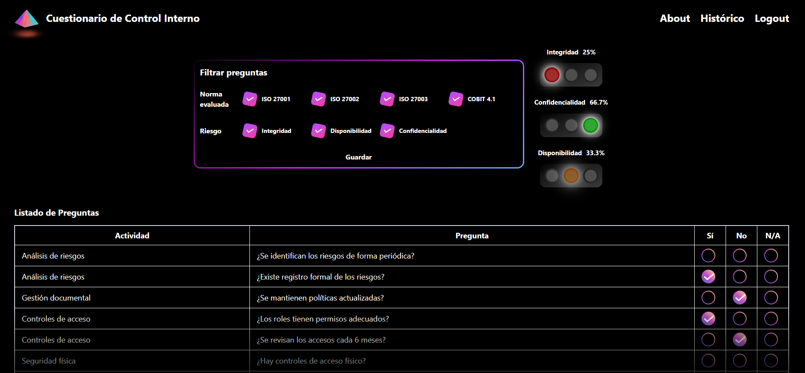

# 📝 Risk Assessment Questionnaire
Sistema de evaluación de riesgos basado en normas internacionales mediante cuestionarios dinámicos.

## 📌 Descripción General
Risk Assessment Questionnaire es una plataforma full-stack diseñada para evaluar el nivel de riesgo de una organización utilizando cuestionarios basados en normas internacionales (como ISO y otras normativas internas o externas).
El sistema calcula los niveles de riesgo mediante los indicadores I (Integridad), S (Seguridad) y C (Confidencialidad), generando resultados históricos y trazables.

Incluye:
- Autenticación de usuarios (login y registro)
- Gestión de normas, preguntas y evaluaciones
- Historial completo de evaluaciones realizadas
- Interfaz intuitiva para responder cuestionarios
- Backend API REST con Laravel
- Frontend dinámico construido en Vue.js + Vite

## ✨ Características Principales

✔️ Evaluación de riesgos con métricas I, S y C  
✔️ Módulo de autenticación (login/registro)  
✔️ Cuestionarios dinámicos según norma seleccionada  
✔️ Historial de evaluaciones realizadas por la organización  
✔️ API REST organizada en controladores modularizados  
✔️ Frontend moderno con Vue Router y Pinia  
✔️ Indicadores visuales (semáforo de riesgo)  
✔️ Arquitectura clara y escalable  

## 🏗️ Tecnologías Utilizadas
### 🗄️ Backend

- Laravel 11
- PHP 8.2
- MySQL 8
- JWT / tokens para autenticación
- Estructura MVC

### 🧩 Frontend

- Vue.js 3 + Composition API
- Vite
- Pinia (state management)
- Vue Router
- CSS Modules

### 🛠️ Tooling

- Composer
- Node.js
- Git & GitHub
- FileTree Pro (documentación del repositorio)

## 🧱 Arquitectura del Proyecto

El sistema se divide en tres módulos principales:

### 🔧 Backend (Laravel)
```bash
/app/Http/Controllers/Api — controladores API (Auth, Evaluaciones, Preguntas)
/app/Models — modelos de base de datos
/database/migrations — tablas (usuarios, normas, evaluaciones, respuestas)
/routes/api.php — rutas expuestas al frontend
```
### 🖥️ Frontend (Vue + Vite)
```bash
/src/components — componentes de UI
/src/stores — estado global (evaluaciones, preguntas, autenticación)
/src/views — pantallas principales (Login, Home, About)
/src/router — rutas del sistema
```
Esta arquitectura permite escalar fácilmente el sistema y mantener una separación clara entre capas y responsabilidades.

## 🧰 Requisitos Previos

Asegúrate de tener instalado:

- PHP >= 8.2
- Composer
- MySQL 8
- Node.js >= 18
- NPM o Yarn

## 🚀 Instalación
1. Clonar el repositorio

```bash
git clone https://github.com/sebastian-alpizar/risk-assessment-questionnaire.git
cd risk-assessment-questionnaire
```

### ⚙️ Configuración del Backend

2. Copiar y configurar el archivo `.env` a partir de `.env.example`:
```bash
cd backend
cp .env.example .env
```
Editar `.env` con tus credenciales de base de datos y configuración de puerto

3. Construir el proyecto Backend
```bash
cd backend
composer install
php artisan key:generate
php artisan migrate
```

4. Iniciar el servidor Backend
```bash
php artisan serve
```

### 🖥️ Ejecución del Frontend
6. Copiar y configurar `.env` a partir de `.env.example`:
```bash
cp .env.example .env
```
Editar `.env` con las credenciales y puerto del Backend al que conectarse:

7. Construir el proyecto
```bash
cd frontend
npm install
```

8. Ejecutar Frontend:
```bash
npm run dev
```
El frontend se ejecutará típicamente en:
👉 http://localhost:5173

## 📡 Comunicación del Sistema

🔄 Flujo General

1. El usuario inicia sesión o se registra
2. Selecciona una norma
3. Contesta el cuestionario (I, S, C)
4. El sistema calcula el nivel de riesgo
5. La evaluación se guarda
6. Puede consultar evaluaciones pasadas

## 📊 Ejemplos Visuales


## 📦 Despliegue

Opciones recomendadas:

**Opción 1 – Backend (Laravel Forge o VPS)** 

- Configurar `.env`
- Ejecutar migraciones
- Servir con Nginx/Apache

**Opción 2 – Frontend**
```bash
npm run build
```
Publicar `/dist` en:
- Netlify
- Vercel
- Render

## 👤 Autor

**Desarrollado por Sebastián Alpízar Porras**  
GitHub: https://github.com/sebastian-alpizar  
Email: sebastianalpiz@gmail.com
